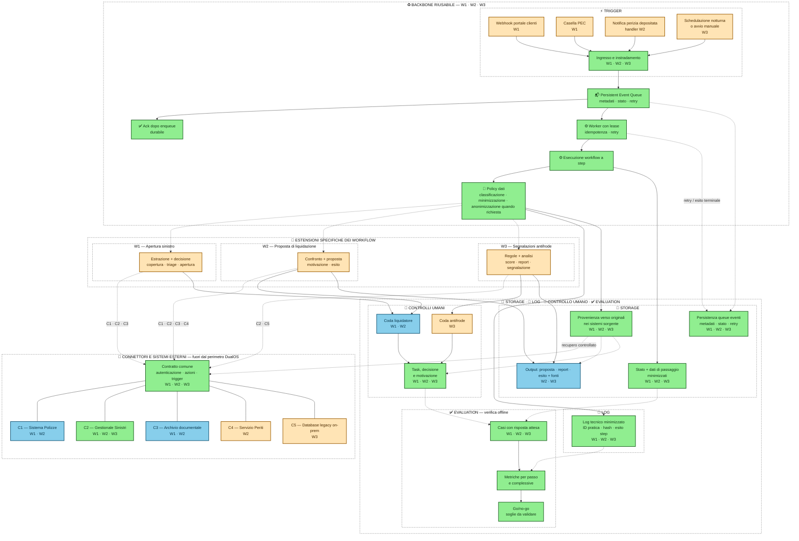
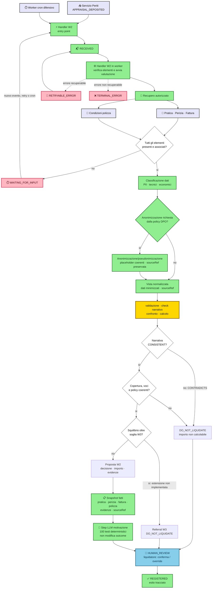

# Documento di consegna — test tecnico FDE

Questo documento risponde ai punti 1, 3, 4 e 5 della traccia. Workflow scelto: **W2 — Proposta di liquidazione**.
[Repository remoto](https://github.com/dox-op/ep-datapizza-assicurazioni)

## 1. Design

### Scopo, perimetro e assunzioni

W2 prepara una proposta motivata per il liquidatore. Non decide definitivamente il sinistro e non scrive nel Gestionale Sinistri.

Il perimetro implementato è la componente TypeScript più un morsetto locale di test run: legge quattro envelope JSON mock dei sistemi esterni, simula autenticazione, adatta i record normalizzati, verifica coerenza narrativa tra pratica e perizia, confronta voci di perizia e fattura, applica copertura, massimale e franchigia, poi restituisce decisione proposta, importo liquidabile o non calcolabile, evidenze, motivazione e indicazione di controllo umano. Il morsetto scrive un outcome JSON; non è un parser documentale né un connettore produttivo.

Assunzioni:

- L'evento `APPRAISAL_DEPOSITED` attiva un handler W2. L'handler verifica presenza e associazione di pratica, perizia, fattura e condizioni di polizza, poi avvia la valutazione.
- W2 assume che pratica e fattura arrivino insieme alla perizia oppure che la pratica sia l'ultimo elemento ad arrivare. Un worker schedulato via cron esegue lo stesso handler in modalità difensiva e verifica anche la presenza della perizia. Se manca un elemento, l'handler lascia il caso in attesa di nuovo evento o retry.
- L'associazione usa numero pratica, targa della fattura e ID polizza associato.
- La prima slice tratta una sola fattura del meccanico e una sola categoria di costo, `MECHANICAL_REPAIR`.
- Il primo step LLM confronta narrativa originaria della pratica e narrativa della perizia. Il check usa un mock guidato da fixture con esito `CONSISTENT` o `CONTRADICTS` con temperatura 0 (da poi rimpiazziare con Jev), prompt inglese e nessuna rete. `CONTRADICTS` forza `DO_NOT_LIQUIDATE`, importo `null`, stato `NOT_COMPUTABLE` e controllo umano.
- Il secondo step LLM produce la motivazione usando uno snapshot esplicito di pratica, perizia, fattura, copertura, massimale, franchigia, decisione, importo, evidenze e fonti. Non può modificare decisione, importo o controllo umano.
- Una fattura superiore alla perizia oltre soglia configura un referral W3; nel harness la soglia è 30%.
- Targa assente o non associata produce `DO_NOT_LIQUIDATE` e controllo umano, senza referral W3: è assunto come errore di associazione documentale, non un segnale antifrode autonomo.

### Componenti logici comuni a W1, W2 e W3

Questo design mostra i componenti logici necessari per W1, W2 e W3, i sistemi esterni coinvolti e il livello di riuso proposto.

Workflow rappresentati:

- **W1 — Apertura sinistro:** webhook dal portale clienti o casella PEC; estrazione, verifica copertura, triage e apertura pratica.
- **W2 — Proposta di liquidazione:** notifica di perizia depositata; confronto tra perizia, fattura e condizioni di polizza; proposta motivata ed esito liquidatore.
- **W3 — Segnalazioni antifrode:** avvio notturno o manuale; analisi di storico e narrative; regole e analisi; score spiegato, report e segnalazione.

Il backbone seguente è condiviso da W1, W2 e W3. I sistemi cliente e le integrazioni restano fuori dal perimetro implementato.

### Legenda colori

| Colore | Significato |
|---|---|
| Verde | Componente riusato da W1, W2 e W3. |
| Azzurro | Componente riusato da due workflow. |
| Arancio | Componente specifico di un workflow. |
| Grigio tratteggiato | Confine logico della sezione; non indica riuso. |
| Lilla | Sistema del cliente esterno a DualOS; non è un componente logico interno. |

### Piano dati trasversale di intakes

1. Il trigger costruisce un envelope con metadati, payload minimizzato, riferimenti alle fonti e tipo di evento; la queue lo persiste (es. tabella, check con DualOS) prima dell'ack. I metadati non contengono informazioni sensibili PII ma solo riferimenti tecnici a dati come perizia (es. chiave artificiale per risalire a PEC), fattura (codice fattura), pratica (numero pratica o uuid).
2. Un worker acquisisce l'evento con lease e avvia l'esecuzione; retry e stato terminale restano associati allo stesso evento.
3. I connettori leggono gli originali dai sistemi sorgente autorizzati tramite metadati non sensibili: archivio documentale, Sistema Polizze o database legacy.
4. La policy dati classifica le informazioni recuperate e costruisce una vista di lavoro minimizzata; applica anonimizzazione quando richiesta dal DPO.
5. Vista di lavoro, stato intermedio, envelope della queue e log non ricevono la copia integrale dell'originale, ma una versione con placeholder. I valori kv dei placeholder sono in mano all'envelope, che si occupa, eventualmente, di fare un fill-up on demand con callback se una funzione necessita di informazioni dinamiche agguntive e non recuperate staticamente nella preparazione del workflow, in modo da mantenere agnostico il contenuto programmatico del workflow.
6. La provenance conserva il riferimento all'originale. Report, analisi e controllo umano recuperano l'originale tramite il connettore e il percorso autorizzato quando il workflow interno è completato.

### Desincronizzazione dei trigger

La `Persistent Event Queue` è comune a W1, W2 e W3. Il trigger resta sincrono fino alla persistenza dell'envelope; dopo l'ack il worker esegue il caso senza mantenere aperta la richiesta originaria.

Esempio W2: la ricezione della notifica di perizia attiva un handler che verifica presenza, associazione e disponibilità di pratica, perizia, fattura e condizioni di polizza. Quando gli elementi sono disponibili, l'handler produce un evento `PERIZIA_DISPONIBILE` con `eventId`, `eventType`, `workflowType`, `correlationId`, `practiceId`, `createdAt`, payload minimizzato o riferimenti autorizzati e stato iniziale; la queue separa ricezione ed elaborazione. Se un elemento manca, il caso resta in attesa di nuovo evento o retry.
Questo per evitare di gestire in un punto sincrono più problemi temporali di accesso risorse esterne.

Per il caso difensivo, lo stesso handler è lanciabile come worker via cron. Questa esecuzione verifica anche la presenza della perizia e recupera i casi che non hanno prodotto o ricevuto correttamente l'evento atteso.

Il contratto comune assume consegna **at-least-once**: lo stesso evento può essere consegnato più volte, quindi il worker deve essere idempotente rispetto a `eventId`. Non viene assunto ordering globale; ordering per pratica resta una decisione da validare se un workflow lo richiede. Il disegno non sceglie tabella, broker o tecnologia di storage.

### Perimetri delle tipologie

| Tipologia | Responsabilità | Fuori perimetro |
|---|---|---|
| **Trigger** | Riceve evento o avvio schedulato/manuale, costruisce envelope e attende persistenza nella queue prima dell'ack. | Decisioni di business e accesso diretto ai sistemi esterni. |
| **Queue eventi** | Persiste envelope, tipo evento, correlazione, stato, tentativi e metadati di lease; separa ricezione ed elaborazione. | Ordinamento globale, tecnologia di storage e garanzie ulteriori rispetto all'at-least-once assunto. |
| **Worker** | Acquisisce eventi con lease, invoca esecuzione comune o specifica, applica idempotenza e aggiorna retry/esito terminale. | Decisioni di business non appartenenti al workflow assegnato. |
| **Connettori** | Incapsula accesso autenticato, azioni e trigger verso sistemi cliente. Permette lettura controllata degli originali senza trasferirne il contenuto nei log. | Regole di triage, confronto documentale e scoring. |
| **Logica** | Esegue step comuni, applica policy dati e logica specifica W1, W2 o W3. | Dettagli endpoint e implementazione del motore DualOS. |
| **Storage** | Conserva queue eventi, stato e dati di passaggio minimizzati, output e riferimenti di provenance. Gli originali restano nei sistemi sorgente. | Traccia tecnica completa dell'esecuzione, che appartiene ai log. |
| **Log** | Registra step ed esiti tecnici usando rappresentazione minimizzata, senza PII secondo l'ipotesi DPO. | Fonte autorevole per pratica, proposta o report di business. |
| **Evaluation** | Esegue verifica offline su casi con risposta attesa, metriche e criteri go/no-go. | Decisione operativa di pratica reale. |
| **Controlli umani** | Crea task, raccoglie decisione, override e motivazione quando il workflow richiede intervento umano. | Autenticazione o scrittura diretta nei sistemi: passano dai connettori. |

### Implementazione scelta

Raffinata la proposta di liquidazione senza estendere il perimetro a connettori o workflow end-to-end:
- input normalizzato: pratica, perizia, fattura e condizioni di polizza;
- preparazione dati: classificazione delle informazioni, minimizzazione e anonimizzazione o pseudonimizzazione secondo policy DPO, con placeholder coerenti e `sourceRef` preservata;
- wrapper locale: sostituisce i valori PII configurati con placeholder `[PII_NNN]`, conserva `placeholder -> originale` in una Map privata e reidrata il solo output finale;
- analisi deterministica: validazione, confronto delle evidenze e calcolo dell'importo candidato;
- output: proposta binaria di liquidazione, importo liquidabile oppure non calcolabile, evidenze e flag di suggestion controllo umano, per questo esempio sarebbe ;
- harness su due chiamate LLM: as-a-judge e narrative;

### W2 — Proposta di liquidazione

| Aspetto | Comportamento |
|---|---|
| Dati | Pratica: numero, narrativa originaria, targa, polizza, valuta. Perizia: narrativa, voci economiche, danni a persone/cose, rivalse ed evidenze. Fattura: targa, tipo, categoria, voci e totale. Polizza: copertura, franchigia, massimale e regole per categoria. Prima dell'analisi, la policy dati classifica le informazioni, minimizza la vista di lavoro e applica anonimizzazione o pseudonimizzazione quando richiesta dal DPO; `sourceRef` mantiene la provenienza senza trasferire l'originale nella pipeline. |
| Calcolo | Semplificato per traccia: per ogni voce il candidato è il minore tra perizia e fattura; il totale è limitato da massimale e franchigia. |
| Output | `LIQUIDATE` o `DO_NOT_LIQUIDATE`; importo in unità minime o `null`; evidenze con `sourceRef`; stato importo; controllo umano; motivazione che espone copertura, massimale, franchigia, perizia e fattura. |
| Errori | Input incoerente o senza fonti produce proposta negativa, importo non calcolabile e controllo umano. Pratica, perizia, fattura o polizza mancanti portano ad attesa, nuovo evento o retry; errore non recuperabile è terminale e non registra esito. |
| Confine implementato | Nessun connettore, OAuth, OCR, matching semantico, queue reale, persistenza DualOS, adapter LLM produttivo, routing W3 o scrittura nel Gestionale. |

La scelta implementata massimizza valore e rischio controllato: riduce il confronto documentale ripetitivo e rende ogni cifra verificabile, ma rimane isolata da integrazioni e decisione finale. La preparazione dati riduce l'esposizione delle informazioni sensibili e conserva la provenienza tramite `sourceRef`. Il primo step LLM è un gate narrativo; il secondo produce una motivazione vincolata ai fatti.

*Nota implementativa: LLM è attualmente mocked: sceglie una tra 100 formulazioni in modo deterministico; non modifica decisione, importo o evidenze.*

## 3. Evaluation

### Dati reali e costruzione del set

- I dati restano in possesso delle strutture legacy del cliente. I workflow e casi identificati sono workflow funzionali, che possono fare retrieve (check con IT Architect necessario in punto 5) di dati on-demand. Li leggiamo rispettando il vincolo che non siano trasportati fuori UE, con accesso minimo necessario; applichiamo una pseudonimizzazione di PII, sostituendo i dati nei documenti da passare la nostro workflow con placeholder semanticamente coerenti e coesi, chiedendo ai system prompt che devono lavoare su dati estratti dai documenti di rispettare questa sostituzione; i dati originali e sensibili li conserviamo in workflow sostituendoli solo al momento di produzione di output (report o JSON) se necessario. I PII vengono quindi rimossi dalla pipeline in cima e rimessi a valle, rendendo completamente agnostico ogni valutazione statica. Gli output rientrano poi nei sistemi cliente.
- Senza utilizzare file reali di clienti reali della compagnia, chiederei di produrre dei test coerenti con casi reali e limite, testando i limiti degli stati e lifecycle di una pratica. Sicuramente 1 test R/G per ogni limite atteso derivato possibilmente da un caso reale, chi definirebbe le risposte attese sarebbero proprio liquidatore senior e responsabile antifrode. Dedicherei invece dei test difensivi e con Stryker su limiti meccanici del codice: non serve coinvolgere il cliente per testare codice difensivo di riferimenti decisi tra entità (esempio targa fattura e perizia non coincidono).

### Metriche, guardrail e gate

Le metriche business usano una baseline del processo attuale; le metriche tecniche usano fixture, fault injection, replay e osservabilità per step.

#### KPI di business

| KPI | Definizione | Soglia iniziale e motivazione |
|---|---|---|
| Proposte confermate senza override | Percentuale di proposte confermate dal liquidatore senza modifica della decisione o dell'importo | `>= 70%` sui casi eleggibili; soglia iniziale di utilità operativa, da segmentare per caso normale, incoerente, non calcolabile e referral W3. |
| Proposte con override rispetto alla valutazione macchina | Percentuale di proposte modificate, distinta in aumento, riduzione, rifiuto e cambio di stato | Nessun aumento non spiegato rispetto alla baseline; la direzione dell'override distingue errore di importo, errore di decisione e bisogno di regole mancanti. |
| Tempo attivo del liquidatore | Tempo speso dal liquidatore per verificare fonti, leggere motivazione e confermare o modificare la proposta | Riduzione iniziale `>= 20%` rispetto alla baseline; misura il beneficio diretto senza confonderlo con il tempo di attesa dei sistemi esterni. |
| Tempo attivo del team antifrode | Tempo complessivo speso dagli analisti antifrode per esaminare una segnalazione, richiedere o verificare evidenze, classificare il rischio e chiudere o inoltrare il caso; esclude attese di coda e sistemi esterni | Riduzione iniziale `>= 20%` rispetto alla baseline su casi comparabili; soglia coerente con quella del liquidatore e misurabile prima di fissare un target cliente definitivo. Segmentare tra referral W2 e casi generati da W3; verificare insieme backlog e casi aperti oltre SLA. |
| Rispetto delle tempistiche di avanzamento della pratica | Percentuale di transizioni di stato completate entro la scadenza business o legale applicabile; ogni transizione conserva `enteredAt`, `dueAt`, `completedAt`, timezone, versione della regola e motivazione di eventuali sospensioni | `100%` delle scadenze legali; `>= 95%` degli SLA business iniziali rispetto alla baseline. La soglia legale è assoluta perché una violazione non si compensa con la puntualità di altri casi; lo SLA business resta un target iniziale da validare per stato, workflow e causa del ritardo. |
| Tempo da perizia disponibile a decisione | Tempo complessivo tra disponibilità degli input e decisione del liquidatore | Non superiore alla baseline; il flusso non trasferisce il risparmio del liquidatore in attese tecniche. |
| Pratiche gestite senza integrazione manuale aggiuntiva | Percentuale di casi completati con i dati e i connettori previsti, senza richieste manuali fuori processo | Non inferiore alla baseline; misura la qualità dell'integrazione progettata, non solo la correttezza del calcolo. |
| Invii a controllo umano | Percentuale di casi inviati a liquidatore per incoerenza, fonte mancante, non calcolabilità, referral o policy | Valore atteso definito per segmento; nessuna soglia unica prima di conoscere la distribuzione dei casi. Un aumento non è negativo se riduce liquidazioni errate. |
| Scostamento tra proposta e decisione finale | Differenza tra importo proposto e importo confermato, analizzata per categoria, causa e direzione | Nessuna soglia aggregata iniziale; ogni scostamento è classificato e usato per aggiornare oracle, regole o dati mancanti. |

Otterrei queste valutazioni anche mezzo tag e potenziale dashboard di prodotto DualOS da mostrare al cliente direttamente dentro al prodotto DualOS, con l'obiettivo di renderli self service per quanto riguarda l'accesso a queste valutazioni. A supporto di questo punto, non è necessario per queste metriche avere dati specifici degli utenti o PII quindi non troviamo scontro contro retention dati.

#### Guardrail di qualità, costo, latenza, sicurezza e privacy

| Area | Guardrail e metrica | Soglia iniziale | Motivazione |
|---|---|---:|---|
| Qualità | Exact match di decisione e importo rispetto agli oracle; liquidazioni positive su casi incoerenti; completezza delle `sourceRef`; mutazioni dell'outcome da parte della motivazione | `100%` exact match; `0` liquidazioni positive non previste; `100%` fonti richieste; `0` mutazioni | Errori su decisione, importo, fonti o stato alterano direttamente la proposta al liquidatore. |
| Costo | Chiamate LLM per pratica; retry per step esterno; costo unitario per percorso normale, errore e retry | Massimo `2` chiamate LLM; massimo `1` retry per step esterno; costo entro budget approvato | Limita consumo non necessario e rende attribuibile ogni costo a pratica e step. |
| Latenza | p95 del nucleo deterministico; p95 del flusso tecnico; eventi con timeout o retry in stato esplicito | Nucleo deterministico `<= 1 s`; flusso tecnico `<= 5 min`, esclusi attese esterne e controllo umano; `100%` stati espliciti | Separa prestazioni controllabili da sistemi esterni e impedisce casi senza stato recuperabile. |
| Sicurezza | Segreti in repository, fixture, log e prompt; accessi non autorizzati; accessi ai dati originali senza audit | `0` segreti; `0` accessi non autorizzati; `100%` accessi auditati | Una sola esposizione o accesso non autorizzato blocca il rilascio. |
| Privacy | PII nei dati sintetici e nei log; campi classificati; retention, residency e accesso on-demand ai dati originali | `0` PII non autorizzata; `100%` campi classificati; approvazione DPO/IT prima dell'uso di dati reali | Il percorso dati deve essere autorizzato prima di introdurre dati cliente nella valutazione. |

#### Metriche per passaggi principali e flusso complessivo

| Passaggio da validare | Cosa dimostra | Metriche | Soglia iniziale motivata | Fonte della misura | Esito se soglia fallisce |
|---|---|---|---|---|---|
| Disponibilità e completezza degli input necessari alla valutazione | Pratica, perizia, fattura e condizioni di polizza sono presenti, leggibili, associabili e sufficienti oppure il caso resta in attesa/retry | Tasso di input completi; calcoli avviati con input mancanti; tempo in `WAITING_FOR_INPUT` | `100%` dei casi calcolabili completi; `0` calcoli con input mancanti; ogni caso incompleto ha stato esplicito | Fixture, fault injection, log di stato | Stop del caso; attesa/retry o proposta negativa con controllo umano. |
| Correttezza dell'identità e dell'associazione tra pratica, perizia, fattura e polizza | Gli identificativi concordano e riferimenti discordanti non entrano nel calcolo | Match rate degli identificativi; calcoli con riferimenti discordanti; duplicati rilevati | `100%` match nei casi calcolabili; `0` calcoli su riferimenti discordanti; `100%` duplicati gestiti con idempotenza | Fixture, fault injection, audit trail | No-go del caso e controllo umano; nessuna proposta positiva. |
| Qualità della normalizzazione, minimizzazione e provenienza dei dati | La vista di lavoro conserva significato, unità, categorie e `sourceRef`; dati sensibili non necessari restano fuori | Campi obbligatori normalizzati; `sourceRef` complete; PII nei log, prompt e fixture | `100%` campi obbligatori e fonti richieste; `0` PII non autorizzata | Validatori, snapshot, test di leakage | Blocco del caso o del rilascio secondo la gravità; nessun calcolo con vista incompleta. |
| Correttezza e determinismo della decisione e dell'importo liquidabile | Stesso input produce stesso risultato; copertura, massimale, franchigia e voci seguono regole definite | Exact match decisione/importo; replay con stesso input; errori di arrotondamento | `100%` exact match; `0` errori di arrotondamento; `100%` replay identici | Oracle, test deterministici, replay | No-go; correggere regola o fixture prima del rilascio. |
| Coerenza tra narrativa, dati strutturati, evidenze e proposta | Il check narrativo rileva contraddizioni e ogni proposta calcolabile è sostenuta dalle fonti richieste | Exact match `CONSISTENT`/`CONTRADICTS`; casi `CONTRADICTS` liquidati; fonti mancanti | `100%` esiti narrativi corretti; `0` `CONTRADICTS` liquidati; `100%` fonti richieste | Fixture narrative, oracle, snapshot outcome | Proposta negativa e controllo umano; fallimento bloccante se il caso viene liquidato. |
| Fedeltà della motivazione generata rispetto all'outcome deterministico | La motivazione espone fatti disponibili senza alterare decisione, importo, stato, evidenze o controllo umano | Diff prima/dopo sui campi protetti; fatti senza fonte; motivazioni non coerenti | `0` mutazioni; `0` fatti senza fonte nei test vincolanti | Snapshot prima/dopo, test prompt, invarianti | No-go; scartare la motivazione e conservare outcome deterministico. |
| Gestione, responsabilità e tracciabilità del controllo umano | Referral, conferme, override, motivazioni, attore, timestamp e stato finale sono ricostruibili | Casi con review presente; override attribuiti; audit trail completo | `100%` dei casi che richiedono review; `100%` override tracciati | Audit trail, contratto HITL, test di lifecycle | No-go; nessun esito finale senza controllo o audit richiesto. |
| Affidabilità, costo e latenza del flusso W2 complessivo | Il flusso gestisce retry, timeout, errori terminali e duplicati senza perdere eventi o produrre doppie proposte | p95 latenza tecnica; costo per pratica; retry rate; errori terminali; eventi persi o duplicati | p95 tecnico `<= 5 min`; massimo `1` retry per step; `0` eventi persi; `0` doppie proposte; massimo `2` chiamate LLM | Log tecnico, metriche workflow, fault injection | No-go; blocco del rilascio finché recovery e idempotenza non sono dimostrati. |

#### Criteri go/no-go

| Gate | Evidenza richiesta | Go | No-go |
|---|---|---|---|
| Correttezza della decisione e dell'importo | Oracle per casi calcolabili, non calcolabili, limite e incoerenti; replay deterministico | Decisione e importo coincidono con l'oracle; importo `null` e `NOT_COMPUTABLE` nei casi previsti | Una decisione o un importo errato; una `LIQUIDATE` su caso incoerente o non calcolabile |
| Input, associazioni e fault | Fault injection su input assente, riferimenti discordanti, fonti indisponibili, timeout e retry | Ogni fault produce attesa/retry, proposta negativa o errore terminale tracciato secondo il caso | Calcolo con input invalido; stato mancante; evento perso; doppia proposta da duplicato |
| Tempistiche business e legali | Stato macchina versionato; `enteredAt`, `dueAt`, `completedAt`, timezone, calendario applicabile, sospensioni ammesse e casi oltre SLA | `100%` delle scadenze legali rispettate; `>= 95%` degli SLA business iniziali; ogni sospensione autorizzata e ricostruibile | Una scadenza legale violata o non misurabile; timer mancante; sospensione non autorizzata; caso oltre SLA senza escalation |
| Evidenze, check narrativo e motivazione | `sourceRef` attese; fixture `CONSISTENT`/`CONTRADICTS`; snapshot prima/dopo | Fonti complete; `CONTRADICTS` blocca; motivazione non muta outcome e contiene solo fatti supportati | Fonte mancante; contraddizione liquidata; fatto senza fonte; mutazione dell'outcome |
| Controllo umano e audit | Casi referral/review; registro di conferma, override, attore, timestamp, motivazione e stato | Ogni review obbligatoria è presente; ogni override è ricostruibile | Review assente; override non attribuibile; audit trail incompleto |
| Costo e latenza | Metriche per step e flusso; conteggio chiamate, retry, timeout e costo unitario | Soglie iniziali rispettate o budget/SLO approvati; anomalie attribuibili | Budget superato senza approvazione; latenza fuori soglia senza recovery; retry loop |
| Sicurezza e privacy | Test di leakage; repository e fixture senza segreti; audit accessi; classificazione e percorso dati | Zero esposizioni; accessi autorizzati e auditati; trattamento dati approvato da DPO/IT | Segreto o PII non autorizzata; accesso fuori autorizzazione; retention o residency non approvata |
| Prontezza della valutazione | Oracle cliente, baseline business/operativa, set stratificato, soglie approvate e ownership dei gate | Evidenze disponibili, responsabili identificati e criteri accettati prima del rilascio | Oracle, baseline, soglie o approvazioni mancanti; impossibilità di interpretare il risultato |

## 4. Domande prioritarie

P0 blocca la definizione stabile di architettura, perimetro o modello operativo: la risposta può cambiare completamente l'implementazione. P1 definisce limiti, soglie, governance o priorità: l'implementazione può procedere con assunzioni esplicite e validazione successiva.

| Priorità | Destinatario | Domanda |
|---|---|---|
| P0.1 | Team di prodotto interno DualOS | Quali componenti comuni — trigger, queue, worker, storage, log, evaluation e controllo umano — sono già disponibili in DualOS, quali devono essere implementati e quali restano sistemi esterni? Quali contratti e garanzie offre DualOS per ciascun componente? |
| P0.2 | Team di prodotto interno DualOS | Quali extension point e contratti offre DualOS per aggiungere W1, W2 e W3 riusando trigger, connettori, storage, log, evaluation e controllo umano senza duplicare componenti? |
| P0.3 | IT Architect | Quali sono i formati e i contratti dei dati di output di "Servizio Periti", "Fatture" e delle entità esposte dai servizi del cliente? Quali garanzie operative valgono per timeout, rate limit, retry, risposte parziali, duplicati, eventi fuori ordine, idempotenza e versionamento dei contratti? Quale recovery e ownership valgono per ogni failure mode? |
| P0.4 | DPO | Quali dati possono entrare in log e prompt? Quali base giuridica, retention, DPIA, provider UE e autorizzazioni? |
| P0.5 | DS + Head of Claims + liquidatore senior | Nella macchina a stati finiti che descrive il ciclo di vita di una pratica, ci sono molti momenti di lunga latenza. Cosa succede se questi limiti non sono rispettati, in ognuno dei casi prescritti (esempio: non arriva in tempo perizia per completamento valutazione liquidazione)? Ci sono conseguenze legali o economiche per il cliente? Quali fallback il cliente già applica e quali vuole continuare ad applicare con la nostra soluzione? |
| P0.6 | DS + Head of Claims + liquidatore senior + IT Architect | Quali casi richiedono controllo umano obbligatorio, chi può confermare o sovrascrivere la proposta W2, quali motivazioni servono per l'override e quale evento chiude formalmente la pratica? Cambia stati, permessi, audit trail e evaluation. |
| P1.1 | DS + Head of Claims + liquidatore senior + IT Architect | Quali regole applicano IVA, valuta, arrotondamenti, franchigia, massimale, più fatture, fatture integrative o note di credito? In quale ordine si applicano? Cambia il modello monetario, l'algoritmo, gli oracle e i casi di controllo umano. |
| P1.2 | DS + Head of Claims + responsabile antifrode + IT Architect | Chi è responsabile di approvare, modificare e versionare le regole e soglie che governano W2 e W3? Come si registra quale versione ha prodotto ogni proposta? |
| P1.3 | Liquidatore senior + responsabile antifrode | Quali sono le soglie che già in W2 di differenza tra fattura e perizia possono far scattare warning per antifrode? |
| P1.4 | DPO + IT Architect | Quali sono le retention dei dati nell'archivio documentale? |
| P1.5 | DS + Head of Claims | Quali sono i KPI di business di maggior rilievo? |
| P1.6 | DS + responsabile antifrode | Quante sanzioni per mancata vigilanza in un anno? Cambia quantificazione del rischio W3 e prioritizzazione |
| P1.7 | DS | Quali sono nelle automazioni W1, W2 e W3 i momenti HITL che il cliente si aspetta vengano mantenuti tali? Con che soglie e parametri? Attualmente ho dato degli assunti forti, che si sono riflettuti anche nei KPI, ma andrebbe chiarito e mi aspetto sia il DS a guidare in questo tema |

## 5. Criticità e fattibilità

| Criticità | Conseguenza | Verifica prima di impegni |
|---|---|---|
| Contratti e identità delle integrazioni | Trigger, retry, idempotenza e registrazione non sono contrattuali senza API, timeout, errori e identità definiti. | IT Architect: contratti, limiti, token, scritture e ownership degli errori. |
| Fiducia del cliente negli use case proposti | Gli use case proposti hanno dei rischi forti: economici, legali... Nella conversazione con DS e decisione della roadmap di delivery, sarebbe importante tenere conto anche della fiducia costruita col cliente sulla base di quali temi aggrediamo prima e con quale rischio. Ho scelto di implementare parte del caso W2 seguendo un mio assunto, cioè che 1 implementazione alla volta consequenziale e ho scelto in base a HIGH RISK - HIGH REWARD - CLEAR OUTCOME: RISK perchè a sbagliare non si aumenta KPI corrispondente o peggio si rischia di creare falsi positivi approvati da umani con scarsa revisione, quindi perdite economiche; il REWARD è la fiducia del cliente e il KPI di riduzione tempo liquidatore di analisi e decisione; i CLEAR OUTCOME sono chiari e attesi perchè ho assunto che per prendere fiducia del cliente (*un'azienda di medie-piccole dimensioni per essere una agenzia assicurativa*) potessimo rispettare il flusso di lavoro che già hanno in essere (*pratiche revisionate da umano in ogni step*). Qui la criticità non è tanto fin dove implementare, ma definire la roadmap per costuire fiducia progressivamente | DS: sentiment cliente, temi più cari al business di Head of Claims |
| Semantica documentale e clausole | Il calcolo è errato se `itemCode`, categorie o regole sono impliciti. | Campione documentale, tassonomia e oracle con liquidatori. |
| Conflitto W2/W3 | Una proposta economica non è compatibile con segnalazione antifrode non risolta. | Priorità, SLA, stato condiviso e evento di sblocco, cooridnazione elementi interni a livello di processi business in essere: Responsabile antifrode e Head of Claims |
| Check narrativo | Il mock verifica contratto e impatto dell'esito, non comprensione semantica di casi reali. | Oracle narrativi, error analysis e evaluation del modello reale. |
| Motivazione vincolata ai fatti | Un testo plausibile non è sufficiente se omette copertura, franchigia, perizia, fattura o fonti. | Verifica automatica dello snapshot, citazioni e invarianti di non-mutazione. |
| Privacy | Narrative, targhe e referti elevano rischio in prompt, log e dataset. | DPIA, minimizzazione, access control, retention e residency con DPO. |
| Controllo umano e audit | Output senza fonti, override e tracciamento non è una proposta operativa utilizzabile. | Formato evidenze, responsabilità liquidatore e scrittura tracciata. |
| Evaluation | Senza oracle cliente non esiste dimostrazione di correttezza business. | Set stratificato con risposte attese e gate concordati. |
| Capacità piattaforma | Queue, storage, log, evaluation e connettori sono design logico, non capacità verificate. | Spike tecnico limitato con team di prodotto prima di sviluppo end-to-end. |
